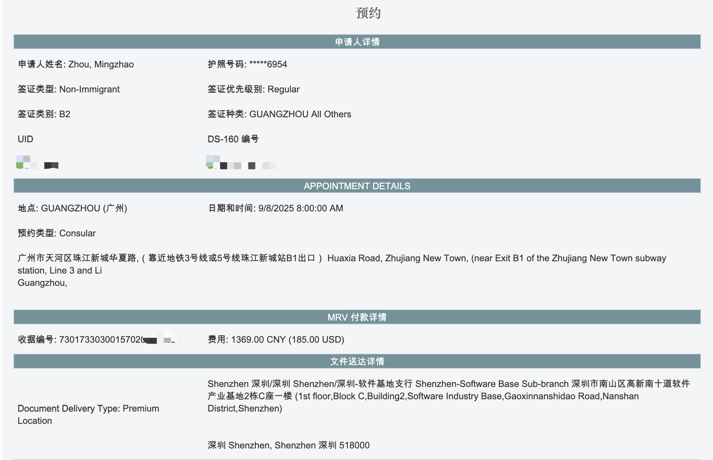
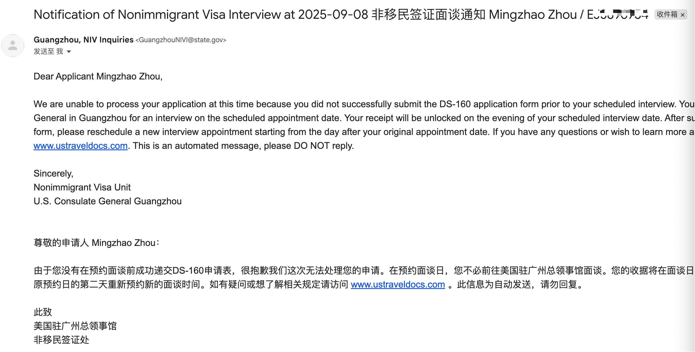
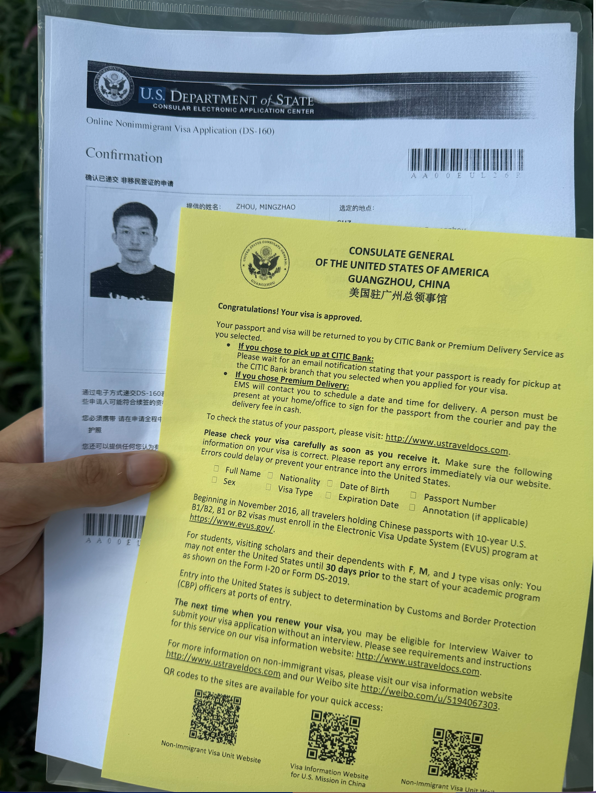

> 突然发现去年8月交的美签预约费用快到期了(只维持一年)，于是在网上预约了2025年9月8日早8点广州领事馆的美签。  

美签办理流程：  
1.先在[DS-160](https://ceac.state.gov/genniv/)填写个人信息，获取UID码之后即可去预约网站预约。  
2.登陆[面签预约网站](https://www.usvisascheduling.com/zh-CN/)，交费，选择护照获取方式，选择预约日期。  
我的是9月8日，到时候更新面签过程。  

---
> 离离原上谱，ds160只保存没提交，185刀签证费直接打了水漂，这个月去不了美国了😭。

> 10月9日，顺利拿下10年美签。

